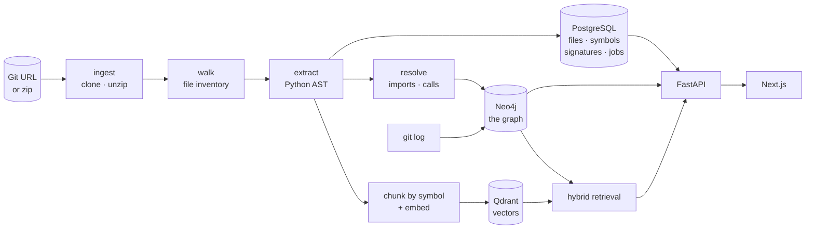

# ARGUS — AI Engineering Intelligence Platform

[](https://github.com/surya27-prog/ARGUS-AI-Engineering-Intelligence/actions/workflows/ci.yml)

> Point it at a repository. Ask what breaks if you change something, and get an
> answer with the evidence attached.

ARGUS ingests a codebase, extracts its structure into a knowledge graph and a
vector index, and answers questions about architecture, change impact and
technical debt — grounded in the actual source rather than in what a model
remembers about a library with a similar name.

---

## The problem

You join a codebase with a million lines in it. Before you can safely change
anything you need to know what depends on it. The documentation is stale, the
authors have left, and reading the code takes weeks.

The specific question is easy to ask and hard to answer:

> *If I change `Session.request`, what breaks?*

Grep finds the string. It does not find the caller three hops away, and it cannot
tell you which of forty matches actually matters.

---

## What makes it more than RAG over a repo

Two things, and both are the reason this exists rather than being a wrapper around
a vector store.

**Hybrid retrieval.** Vector search finds code that *reads* like your question.
The call graph finds code that is *connected* to it. Neither alone is enough:
pure RAG over source misses structural relationships, and pure graph traversal
misses intent. ARGUS retrieves by similarity, then expands the result set through
`CALLS` edges before the model sees it — so an answer can reference the machinery
a semantic search would never have surfaced.

**Every inferred edge carries a confidence.** Python resolves plenty of calls at
runtime, so a static call graph is necessarily incomplete. Rather than hide that,
each `CALLS` edge records *how* it was resolved — a local name at 1.0, a method on
`self` at 0.85 — and blast radius multiplies those confidences along the path.
Ambiguous call sites produce no edge at all and are counted instead, because a
guess that inflates a blast radius is worse than a gap that is visible.

The same honesty runs through the rest: dead-code findings cap at 0.75 confidence
because a call at module scope is invisible to the call graph, and the tool says
so rather than inviting you to delete a live handler.

---

## Screenshots

> **Not yet captured.** The interface is built and builds clean, but the
> screenshots for this section have not been taken — see
> [`docs/release-checklist.md`](docs/release-checklist.md). Placeholders are left
> here deliberately rather than filled with mockups.
>
> To capture them: `docker compose up -d`, start the API and `npm run dev`, ingest
> `https://github.com/psf/requests`, then grab the dashboard, the graph with a
> blast radius lit up, and a chat answer with citation chips.

---

## Features

| | What it does |
|---|---|
| **Ingestion** | A Git URL or a zip. Clones, walks, and parses; the request returns immediately and the UI polls |
| **Dependency graph** | Files, classes, functions and the `CONTAINS` / `IMPORTS` / `CALLS` / `INHERITS` edges between them, in Neo4j |
| **Semantic + hybrid search** | Symbol-level chunks in Qdrant, optionally expanded through the call graph |
| **Grounded chat** | Streaming answers with `path:line` citations that link to the source |
| **Impact analysis** | Ranked blast radius with per-hop decay and the route to every affected node |
| **LLM-explained impact** | The same radius in prose — what breaks, and why |
| **Risk score** | 0–100 per symbol from blast radius, coverage, centrality, coupling and churn, with every factor and weight returned |
| **Co-change coupling** | Files that historically change together, from `git log` — coupling a static analysis cannot see |
| **Tech debt detection** | Complexity, god files, circular imports, dead code, missing docstrings — calibrated against each repository's own distribution |
| **Debt report** | Ranked, filterable, and exportable as Markdown |
| **Dashboard** | Stats, a risk heatmap, the riskiest functions, debt summary |
| **Interactive graph** | Cytoscape canvas with blast-radius highlighting, risk colouring, type filters and collapse-by-module |

---

## How it works



**Three stores, because they answer different questions.**

| Store | Holds | Answers |
|---|---|---|
| PostgreSQL | files, symbols, signatures, docstrings, jobs, chat history | "what exists" — every list and detail view |
| Neo4j | the *relationships* between them | "what depends on what" — blast radius, centrality |
| Qdrant | symbol-level embeddings | "what code is near this question" |

Neo4j stores identity and edges only — no docstrings, no source text. Anything
needing a symbol's body joins back to Postgres. The full design is in
[`docs/architecture/graph-schema.md`](docs/architecture/graph-schema.md).

---

## Design decisions worth defending

The things an interviewer would ask about, and the answers.

**Chunk by symbol, not by token window.** A fixed window splits a function in
half and pairs its tail with an unrelated neighbour's head. Chunking on function
and class boundaries — body plus docstring plus a path header — means every
retrieved chunk is a thing that can be cited.

**Two provider interfaces, not one.** Anthropic has no embeddings endpoint, so a
single `LLMProvider` with `complete()` and `embed()` would be a shape no real
provider can fill. `ChatProvider` and `EmbeddingProvider` are independent, each
selected by one env var — which is also what lets the entire test suite and CI run
against stub implementations with no API key and no billable call.

**No `temperature` parameter anywhere.** It is the knob every provider interface
reaches for first, and on Claude Opus 5 sending it returns a 400 — it was removed,
not deprecated. The interface exposes `effort` instead, which is the supported
control.

**Debt thresholds are relative to the repository.** A 600-line file is
unremarkable in one codebase and the worst offender in another. Every detector
calibrates on its own p90 with an absolute floor, so a finding means *unusual for
this codebase* rather than *over a number someone picked*.

**Caches are keyed on the parse, not on a clock.** A TTL is a guess about
acceptable staleness, wrong in both directions. Keying on the repository's
`parsed_at` makes an entry valid exactly as long as the parse behind it is
current, and invalidates on re-parse with nothing having to remember to.

**The risk score ships its own derivation.** A bare 0–100 is unusable in a
review, because "why?" is the next question every time. Every response carries the
normalised factors, the weights actually applied, the raw metrics and a list of
reasons — so the number can be recomputed by hand and argued with.

---

## Tech stack

| | |
|---|---|
| **Backend** | Python 3.11 · FastAPI · SQLAlchemy 2 · Alembic · psycopg 3 |
| **Frontend** | Next.js 15 (App Router) · React 19 · Cytoscape.js · no CSS framework |
| **Data** | PostgreSQL 16 · Neo4j 5.26 · Qdrant 1.19 |
| **Models** | Anthropic SDK for chat · OpenAI SDK for embeddings, behind two interfaces |
| **Parser** | Python `ast` — standard library only, no third-party dependency |
| **Ops** | Docker Compose · GitHub Actions · Render / Fly · Vercel |

No LangChain and no LlamaIndex. Chunking, retrieval, hybrid expansion and prompt
assembly are roughly 850 lines of application code, and owning them is what makes
the hybrid retrieval above a design choice rather than a framework's default.

---

## Getting started

Needs Docker Desktop, Python 3.11+ and Node 22+. Troubleshooting in
[`docs/SETUP.md`](docs/SETUP.md).

```bash
git clone https://github.com/surya27-prog/ARGUS-AI-Engineering-Intelligence.git
cd ARGUS-AI-Engineering-Intelligence
cp .env.example .env          # required — compose and the API both read it
docker compose up -d          # Postgres :5432 · Neo4j :7687/:7474 · Qdrant :6333
```

```bash
cd backend
python -m venv .venv && .venv/Scripts/python.exe -m pip install -r requirements.txt -r requirements-dev.txt
.venv/Scripts/python.exe -m alembic upgrade head
.venv/Scripts/python.exe -m uvicorn app.main:app --reload
```

```bash
cd frontend && npm install && npm run dev      # http://localhost:3000
```

**Without any API key** you still get ingestion, files, symbols, the graph,
impact, risk and the debt report. Only search and chat need one, and they return a
503 that says which provider is unconfigured rather than failing opaquely. To run
those with no key at all, set `LLM_PROVIDER=stub` and `EMBEDDING_PROVIDER=hash` —
the same implementations CI uses.

Try the parser on its own, with no stack running at all:

```bash
cd parser && python -m parser.cli https://github.com/psf/requests.git --symbols
```

---

## API overview

Interactive docs at `/docs`. Everything is under `/repos/{id}` unless noted.

| Method | Path | |
|---|---|---|
| `GET` | `/health` | Liveness plus each store's reachability. Always 200, so it works as a container probe |
| `POST` | `/repos` · `/repos/upload` | Ingest from a URL or a zip. Returns 202; poll `GET /repos/{id}` |
| `GET` | `/files` · `/symbols` | Paginated, searchable |
| `GET` | `/graph` · `/graph/search` | Nodes and edges, capped for rendering; find a node key |
| `GET` | `/dependencies` · `/dependents` | Depth-limited traversal in either direction |
| `GET` | `/impact` · `/impact/explain` | Ranked blast radius, and the prose reading of it |
| `GET` | `/risk` | Scores with factors, weights and reasons |
| `GET` | `/cochange` | Files that change together |
| `GET` | `/debt` | Findings, or `?format=markdown` for the report |
| `GET` | `/search` | Semantic; `?mode=hybrid` expands through the call graph |
| `POST` | `/chat` | SSE stream with citations |
| `GET` | `/jobs` | Parse history, with per-stage timings |

Every list endpoint takes `limit`/`offset` and returns a total, so a page is never
mistaken for the whole result. `/chat`, `/search` and `/impact/explain` are rate
limited — they call a paid provider.

---

## Repository layout

```
backend/          FastAPI service
  app/api/        route handlers
  app/core/       config, logging, errors, caching, rate limiting
  app/services/   graph, retrieval, chat, impact, risk, debt
  scripts/        profiler and smoke test
parser/           standalone, stdlib-only Python parser
database/         Alembic migrations
frontend/         Next.js dashboard
docs/             architecture, deployment, performance, planning
```

---

## Limitations

Stated plainly, because a tool that overstates what it knows is worse than one
that does less.

- **Python only.** The extension point is one extension→language map plus an
  extractor per language.
- **No type inference.** `self.client.get()` cannot be resolved without knowing
  the type of `self.client`. Such calls are counted as unresolved rather than
  guessed at.
- **Calls at module scope create no edge**, so a function only ever called from
  module level can read as dead code. This is why no dead-code finding exceeds
  0.75 confidence.
- **No authentication.** Deliberately cut; the rate limiter therefore keys on IP,
  which one office NAT shares.
- **One parse at a time.** `BackgroundTasks`, not a queue. `ParseJob` rows exist
  for a real worker to pick up when one is worth adding.

More, with reasoning, in
[`docs/architecture/overview.md`](docs/architecture/overview.md).

---

## Documentation

| | |
|---|---|
| [`architecture/overview.md`](docs/architecture/overview.md) | How the pieces fit, and what is deliberately absent |
| [`architecture/graph-schema.md`](docs/architecture/graph-schema.md) | Node labels, edges, keys, the confidence model |
| [`architecture/rag-design.md`](docs/architecture/rag-design.md) | Chunking, retrieval, the hybrid expansion |
| [`architecture/risk-model.md`](docs/architecture/risk-model.md) | The scoring formula and its weights |
| [`deployment.md`](docs/deployment.md) | Managed services, and a symptom-to-cause table |
| [`performance.md`](docs/performance.md) | Where a parse spends its time |
| [`release-checklist.md`](docs/release-checklist.md) | What is verified and what is not |
| [`planning/TIMELINE.md`](docs/planning/TIMELINE.md) | The six-week plan |
| [`planning/WORKLOG.md`](docs/planning/WORKLOG.md) | What actually happened, day by day |

---

## License

MIT
