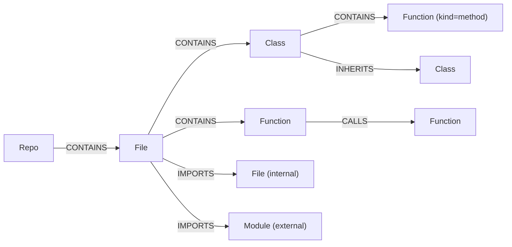

# ARGUS — Knowledge Graph Schema

**Status:** Week 2, Day 1 design. This is the contract the Neo4j writer
(Day 2), the import-resolution pass (Day 3), the call-graph pass (Day 4) and the
query API (Day 5) all build against.

Target: **Neo4j 5.26 Community** (`docker-compose.yml`).

---

## Why a graph at all

Postgres already holds every file and symbol the parser found, and it answers
"what is in this repository" perfectly well. What it is bad at is the question
ARGUS exists to answer:

> If I change `Session.request`, what breaks?

That is a variable-depth reverse traversal over call and import edges. In SQL it
is a recursive CTE that grows unreadable the moment you want per-hop decay,
path reconstruction, or a mix of edge types. In Cypher it is one line.

So the division is deliberate:

| Store | Holds | Answers |
|---|---|---|
| **PostgreSQL** | repositories, files, symbols, signatures, docstrings | "what exists", list and detail views |
| **Neo4j** | the *relationships* between those things | "what depends on what", blast radius, centrality |
| **Qdrant** | symbol embeddings | "what code is semantically near this question" |

Neo4j stores no docstrings, no signatures and no source text. It stores identity
and edges. Anything that needs the body of a symbol joins back to Postgres on
the symbol key.

---

## Node labels



### `:Repo`

One per ingested repository. The bridge back to Postgres.

| Property | Type | Notes |
|---|---|---|
| `key` | string | `repo:{repo_id}` — unique, indexed |
| `repo_id` | string | the Postgres `repositories.id` UUID |
| `name` | string | |
| `url` | string? | null for zip uploads |
| `commit_sha` | string? | |
| `default_branch` | string? | |
| `run_id` | string | the parse run that last wrote this node |

### `:File`

One per parseable source file. `path` is POSIX-separated and relative to the
repo root, exactly as `FileInfo.path` records it.

| Property | Type | Notes |
|---|---|---|
| `key` | string | `file:{repo_id}:{path}` |
| `repo_id` | string | |
| `path` | string | |
| `module` | string? | dotted import path, from the package layout |
| `line_count` | int | |
| `sha256` | string | lets a re-parse skip unchanged files later |
| `parse_error` | string? | set when the file failed to parse |
| `change_count` | int? | commits touching this file in the history window; absent until the co-change pass has run, and on sources with no git history |
| `run_id` | string | |

### `:Class`

| Property | Type | Notes |
|---|---|---|
| `key` | string | `sym:{repo_id}:{module}:{qualname}` |
| `repo_id`, `module`, `qualname`, `name` | string | `qualname` is flattened — `Record.Meta`, never `Record.<locals>.Meta` |
| `line_start`, `line_end` | int | |
| `is_external` | bool | true for a base class ARGUS could not resolve inside the repo |
| `run_id` | string | |

### `:Function`

Functions **and** methods share this label, separated by `kind`. One label keeps
traversals simple: a call edge does not care whether its target is a free
function or a method, and every query that does care can filter on `kind`.

| Property | Type | Notes |
|---|---|---|
| `key` | string | `sym:{repo_id}:{module}:{qualname}` |
| `repo_id`, `module`, `qualname`, `name` | string | |
| `kind` | string | `function` \| `method` |
| `line_start`, `line_end` | int | |
| `is_async` | bool | |
| `param_count` | int | cheap fan-in/fan-out heuristics without joining Postgres |
| `unresolved_calls` | int | call sites in this body that resolved to nothing |
| `run_id` | string | |

### `:Module`

**Only external modules get a node.** This is a deliberate deviation from the
naive five-label model, and it is worth stating why.

In Python an internal module *is* a file. Creating both a `:File` and a
`:Module` node for `app/core/config.py` would mean every import traversal hops
through a node that carries no information the `:File` does not already have,
and every write does twice the work for the same graph. So internal module names
live on `File.module`, and `IMPORTS` edges point straight at the `:File`.

Third-party and stdlib imports have no file in the repository, so they need a
node of their own — and having one turns out to be independently valuable: it is
what makes "which external packages does this repo actually depend on, and which
files pull them in" a one-line query, which Week 5's debt report wants.

| Property | Type | Notes |
|---|---|---|
| `key` | string | `mod:{repo_id}:{dotted_name}` |
| `repo_id` | string | scoped per repo so deleting a repo cannot orphan shared nodes |
| `dotted_name` | string | `os.path`, `urllib3` |
| `top_level` | string | `os`, `urllib3` — what you would pip install |
| `is_external` | bool | always true today |
| `run_id` | string | |

---

## Relationship types

| Type | From → To | Properties | Meaning |
|---|---|---|---|
| `CONTAINS` | `Repo → File`<br>`File → Class`<br>`File → Function`<br>`Class → Function`<br>`Function → Function` | `run_id` | Lexical containment. The last form is a nested definition. |
| `IMPORTS` | `File → File`<br>`File → Module` | `line`, `alias`, `level`, `is_relative`, `resolution` | One edge per import *statement target*. |
| `CALLS` | `Function → Function`<br>`Function → Class` | `lines`, `count`, `resolution`, `confidence` | Aggregated: one edge per caller/callee pair, not per call site. The `:Class` form is a constructor call. |
| `INHERITS` | `Class → Class` | `position`, `resolution` | `position` preserves MRO order. |
| `CO_CHANGED` | `File → File` | `commits`, `jaccard`, `left_commits`, `right_commits`, `last_together` | Week 4. How often the two files appear in the same commit. Symmetric — see below. |

Two notes on shape:

**`CALLS` is aggregated.** A function that calls another twenty times produces
one edge with `count: 20` and `lines: [12, 40, 41, ...]`, not twenty edges. Blast
radius cares about *whether* a dependency exists; call frequency is a weight on
that edge, not a separate fact. This also keeps the edge count roughly linear in
the symbol count rather than in the line count.

**Containment is a single type, not five.** `Repo → File → Class → Function` is
one traversal (`CONTAINS*`) instead of a union of differently-named edges. Where
a query needs the specific shape it filters on the node labels, which Neo4j
indexes anyway.

**The `CONTAINS` endpoint pairs above are the common ones, not the closed set.**
The writer reads the enclosing symbol's label rather than assuming it, so a class
nested in a class (`Class → Class`) or in a function (`Function → Class`) — both
legal Python — produce edges too. A symbol whose enclosing scope was never
extracted as a symbol of its own, such as a `def` inside an `if` block, hangs off
its `:File` instead, so it stays reachable rather than being dropped.

**`CO_CHANGED` is the only edge not derived from the code.** The other four are
facts about what the source says; this one is a fact about how the source has
been edited, read from `git log`. That difference has three consequences:

- It is **stored directed and read undirected.** The writer orders each pair
  lexicographically so a pair cannot be written twice; every query matches
  `-[:CO_CHANGED]-` without an arrow, because neither file causes the other.
- It is **excluded from dependency traversals.** `/dependencies`, `/dependents`
  and `/impact` follow `CALLS|IMPORTS` only. "These change together" is evidence
  *about* a change, not a dependency — admitting it would put every test file in
  every blast radius. The risk score is where it carries weight.
- It is **absent, not zero, when unknown.** A zip upload has no history, so it
  gets no edges and its files get no `change_count`. Zero would claim the file
  has never changed.

---

## Identity and idempotent writes

### The `key` property

Every node carries a single deterministic string `key`, and every write is a
`MERGE` on it:

```cypher
MERGE (f:File {key: $key})
  ON CREATE SET f += $props
  ON MATCH  SET f += $props
```

The obvious alternative is a composite key on `(repo_id, path)`. Two reasons not
to:

1. Neo4j's `NODE KEY` constraint is an Enterprise feature; this project runs
   Community.
2. A `MERGE` on one indexed string property is the cheapest lookup the planner
   can do, and Day 2's requirement is that re-parsing a repository twice leaves
   the node count unchanged. One key, one constraint, one index path.

Key formats are fixed:

```
repo:{repo_id}
file:{repo_id}:{path}
sym:{repo_id}:{module}:{qualname}
mod:{repo_id}:{dotted_name}
```

`module` may be empty for a file outside any package; the colons still separate
the fields, so `sym:abc-123::helper` is well-formed.

**Amended on Day 2 — it is well-formed but not unambiguous.** Two unpackaged
files that each define `helper` produce the same key, and `MERGE` would collapse
two unrelated functions into one node, inventing call and containment edges
between them. So the symbol scope falls back to the file path when the module is
absent:

```
sym:{repo_id}:{module or path}:{qualname}
sym:abc-123:scripts/tool.py:helper
```

Packaged files are unaffected, since a module path is already unique per file.
`app.services.graph_keys` is the only place a key is built, so this rule cannot
drift between the writer and the passes that look nodes up.

### Re-parsing: stamp and sweep

`MERGE` alone is not enough. It makes re-parsing non-duplicating, but it never
removes anything — a file deleted from the repository would live in the graph
forever.

So every write carries a `run_id` (a UUID minted per parse), and the run ends by
sweeping what it did not touch:

```cypher
// 1. write everything with run_id = $run
// 2. then, scoped to this repo only:
MATCH (n {repo_id: $repo_id})
WHERE n.run_id <> $run
DETACH DELETE n
```

Relationships are swept the same way. `DETACH DELETE` removes a stale node's
edges with it, so an edge only needs its own `run_id` when both endpoints
survive but the relationship between them did not — which is the common case for
`CALLS`, so edges carry it too.

This gives the property Day 2 is measured on (parse twice → node count
unchanged) *and* correct removal, which a pure-`MERGE` design silently gets
wrong.

---

## Resolution and confidence

The parser records imports and calls exactly as written and resolves nothing —
resolution needs the whole repository's symbol table, which only exists once
every file has been walked. That resolution happens here, on the way into the
graph, and it is never perfect. Rather than pretend otherwise, every resolved
edge records **how** it was resolved.

### `IMPORTS`

| `resolution` | When | Target |
|---|---|---|
| `internal_module` | the dotted target matches a `File.module` in this repo | `:File` |
| `internal_symbol` | `from app.core.config import Settings` — the module resolves, the trailing name is a symbol in it | `:File` |
| `relative` | resolved by walking `level` dots up from the importing file's package | `:File` |
| `external` | no match in the repo | `:Module` |

**Amended on Day 3.** `internal_symbol` does not verify that the trailing name
is an extracted symbol. The parser does not extract module-level variables or
re-exports, so a name that fails that check is as likely to be a constant as a
mistake — and the file-level dependency is real either way. The rule the
resolver actually applies is therefore about modules, not symbols: try the
deeper `module.name` as a module first (`from app.core import config` is a
module import, not a symbol import); fall back to `module`; then to external.

Relative imports resolve against the *importing file's* module path, not the
repo root. `from ..core.config import get_settings` inside `app/api/health.py`
walks up two levels from `app.api` to `app`, giving `app.core.config`. An
over-deep relative import (more dots than package depth) is recorded as
`external`, since that is what Python would do at runtime — fail — and the fact
is worth keeping rather than dropping.

### `CALLS`

| `resolution` | Confidence | When |
|---|---|---|
| `local` | 1.0 | callee is a bare name defined in the same file |
| `imported` | 0.95 | callee is a bare name bound by an import in this file |
| `attribute_module` | 0.90 | `mod.func()` where `mod` is an imported module |
| `attribute_self` | 0.85 | `self.method()` resolved against the enclosing class and its in-repo bases |

Two cases produce **no edge**:

- **ambiguous** — the name matches several symbols repo-wide with nothing to
  choose between them. Creating an edge to each would inflate every downstream
  blast radius with paths that do not exist.
- **unresolved** — dynamic dispatch, an attribute on a value ARGUS cannot type,
  or a call into an external package.

Both are counted on the calling `:Function` as `unresolved_calls` and logged.
Partial resolution is the expected outcome, not a failure: the Week 4 risk score
reads `confidence` as an edge weight, so a graph that is honest about its
uncertainty produces better numbers than one that guesses.

**Amended on Day 4**, three ways, all found by running the pass against
`psf/requests`:

1. **`CALLS` can target a `:Class`.** `Settings()` is a constructor call and a
   real dependency; restricting the edge to `:Function` would drop it silently,
   because the MATCH simply would not find the node. The edge is still only ever
   *from* a `:Function` — a call at module scope has no function to hang it on
   and is counted separately as `module_level`.
2. **Re-exports are followed, up to two hops.** A name a file imports rather
   than defines resolves through that import. This is the pattern every Python
   package uses — `requests/__init__.py` contains `from .api import get`, so
   `requests.get()` names a function that appears nowhere in `__init__.py`.
   Without it the resolver misses the entire public API of every package it
   looks at: on `requests` this alone was the difference between 508 and 783
   resolved call sites.
3. **A third of in-function call sites resolve, and that is the correct
   number.** The rest are calls out of the repository — builtins, third-party
   packages, and attributes on values ARGUS cannot type. They have no node to
   point at, so an edge would be a fabrication.

### `INHERITS`

Base classes are matched by name against classes in the same file, then against
names imported into that file, then repo-wide. A base that resolves to nothing —
`Protocol`, `BaseSettings`, anything from a dependency — creates a `:Class` node
with `is_external: true`. Keeping it means "everything inheriting from
`BaseSettings`" still works, which is a question people actually ask.

**Amended on Day 4.** External base classes need a key, and the symbol format
has no module or path to build one from. They use a reserved scope segment,
which can never collide with a real module or file path:

```
sym:{repo_id}:external:{name}
```

That makes `BaseSettings` one node however many files inherit from it, which is
the whole point of keeping unresolved bases at all. Two further details from the
implementation: a subscripted base drops its type parameters (`Generic[T]` is
`Generic` — the subscript is not part of the identity), and `position` is part
of the `MERGE` pattern, since a class can legally list the same base twice and
MRO order is the reason the property exists.

`INHERITS` was built on Day 4 rather than Day 3 because `attribute_self` call
resolution needs the hierarchy: `self.method()` is looked up on the enclosing
class *and its in-repo bases*, so the base map has to exist before calls
resolve. The walk is depth-bounded — a malformed hierarchy can be cyclic.

---

## Constraints and indexes

Run once at startup, all `IF NOT EXISTS` so it is safe to repeat:

```cypher
CREATE CONSTRAINT repo_key   IF NOT EXISTS FOR (n:Repo)     REQUIRE n.key IS UNIQUE;
CREATE CONSTRAINT file_key   IF NOT EXISTS FOR (n:File)     REQUIRE n.key IS UNIQUE;
CREATE CONSTRAINT class_key  IF NOT EXISTS FOR (n:Class)    REQUIRE n.key IS UNIQUE;
CREATE CONSTRAINT func_key   IF NOT EXISTS FOR (n:Function) REQUIRE n.key IS UNIQUE;
CREATE CONSTRAINT module_key IF NOT EXISTS FOR (n:Module)   REQUIRE n.key IS UNIQUE;

// Sweeping and every repo-scoped query filter on repo_id.
CREATE INDEX file_repo   IF NOT EXISTS FOR (n:File)     ON (n.repo_id);
CREATE INDEX class_repo  IF NOT EXISTS FOR (n:Class)    ON (n.repo_id);
CREATE INDEX func_repo   IF NOT EXISTS FOR (n:Function) ON (n.repo_id);
CREATE INDEX module_repo IF NOT EXISTS FOR (n:Module)   ON (n.repo_id);

// Symbol lookup by name is how the UI and the chat citations enter the graph.
CREATE INDEX func_qualname  IF NOT EXISTS FOR (n:Function) ON (n.repo_id, n.qualname);
CREATE INDEX class_qualname IF NOT EXISTS FOR (n:Class)    ON (n.repo_id, n.qualname);
CREATE INDEX file_path      IF NOT EXISTS FOR (n:File)     ON (n.repo_id, n.path);
```

A uniqueness constraint creates its own index, so `key` needs no separate one.

---

## Queries this schema has to serve

These are Friday's endpoints, written out now so the schema can be checked
against them rather than discovered to be wrong on Friday.

**Amended on Day 5 — the draft below does not compile, and finding that out on
Monday was the point.** `[:CALLS|IMPORTS*1..$depth]` is a syntax error:
Cypher cannot take a variable-length bound from a parameter, and Neo4j rejects
it with `Parameter maps cannot be used in MATCH patterns`. Depth is therefore
interpolated into the query text as a literal, which is only safe because the
router validates it as an `int` in `1..MAX_DEPTH` before it reaches the query.

Two further corrections the real implementation needed:

- **One row per node, not per path.** The draft returns a row per path, so a
  symbol reachable five ways appears five times. The shipped query keeps the
  strongest shortest path per node and collapses the rest.
- **`CONTAINS` is not traversed.** Only `CALLS` and `IMPORTS` are dependencies.
  Including containment would make every symbol in a file "depend on" every one
  of its siblings.

**`GET /repos/{id}/graph`** — the whole structure, capped for rendering:

```cypher
MATCH (r:Repo {key: $repo_key})-[:CONTAINS]->(f:File)
OPTIONAL MATCH (f)-[i:IMPORTS]->(t)
RETURN f, i, t
LIMIT $limit
```

**`GET /dependencies/{node}`** — what this symbol needs, depth-limited:

```cypher
MATCH path = (start {key: $key})-[:CALLS|IMPORTS*1..$depth]->(dep)
RETURN dep, length(path) AS hops, relationships(path) AS via
ORDER BY hops
```

**`GET /dependents/{node}`** — the reverse, and the foundation of Week 4's blast
radius. Note it is the *same* traversal with the arrow flipped, which is exactly
why these edges are directed:

```cypher
MATCH path = (dependent)-[:CALLS|IMPORTS*1..$depth]->(target {key: $key})
RETURN dependent,
       length(path) AS hops,
       reduce(c = 1.0, r IN relationships(path) | c * coalesce(r.confidence, 1.0)) AS confidence
ORDER BY hops, confidence DESC
```

That `reduce` is the per-hop decay Week 4 needs, and it falls out of storing
confidence on the edge rather than inferring it later.

**External dependency report** (Week 5):

```cypher
MATCH (f:File {repo_id: $repo_id})-[:IMPORTS]->(m:Module)
RETURN m.top_level AS package, count(DISTINCT f) AS files
ORDER BY files DESC
```

---

## What this schema deliberately does not do

| Not modelled | Why |
|---|---|
| Docstrings, signatures, source text | They live in Postgres. Duplicating them into node properties bloats the store and gives two things to keep in sync. |
| Per-call-site nodes | `CALLS` is aggregated with a `count`. Individual call sites are already in the parser output if they are ever needed. |
| Variables, assignments, attributes | Enormous node count, almost no analytical value at this level. |
| Cross-repository edges | Every key is repo-scoped. Comparing two repositories is not a Week 2–6 goal. |
| Type inference | `self.x.y()` where `x` is an instance attribute stays unresolved. Real type inference is a project of its own; the confidence model exists precisely so this gap is visible rather than hidden. |

Co-change edges from git history are **not** here — they arrive Week 4 Tuesday
as a separate `CO_CHANGES` relationship between `:File` nodes, with a frequency
property. They are noted now so nothing in this design blocks them.

---

## Open questions

- **Ambiguous call sites — settled on Day 4: keep dropping them.** The fallback
  was an edge to every candidate at `1 / candidates` confidence. Not worth
  building: on `psf/requests` ambiguity accounts for **7 call sites out of
  2,510**, three tenths of one percent. Fanning those out would add speculative
  paths to every downstream blast radius for no measurable gain.
- **Method resolution through external bases.** A method inherited from a
  third-party class cannot be resolved. Falls out as `unresolved`; acceptable
  unless the fixture repo shows it dominating.
- **Sweep cost on large repos.** The stamp-and-sweep pass touches every node in
  the repository. Fine at fixture scale; revisit in the Week 5 performance pass
  if it shows up.
