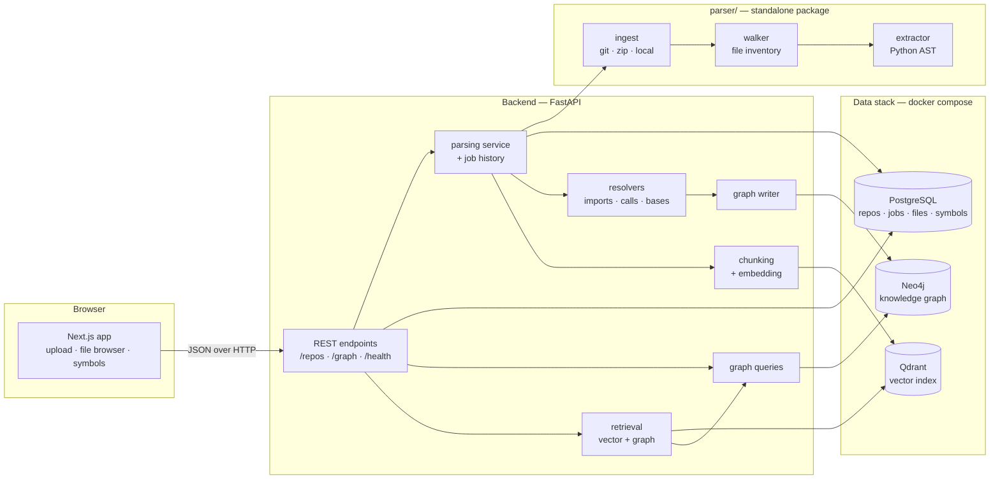

# ARGUS — Architecture Overview

**Status:** end of Week 5 (feature freeze). This document describes what exists
today and the seams the remaining week plugs into. It is updated as the system
grows, not rewritten.

The graph's own design — node labels, edge properties, key formats, the
resolution and confidence model — lives in
[graph-schema.md](graph-schema.md). This page covers how the pieces fit
together; that one covers what the graph actually is.

---

## The problem

Engineers joining a large codebase spend weeks building a mental model of it:
what calls what, which files move together, what breaks if a function changes.
That model lives in people's heads and leaves when they do.

ARGUS builds it mechanically. It ingests a repository, extracts structural facts
from the source, stores them as both a graph and a vector index, and answers
questions about architecture, change impact, and technical debt against those
facts rather than against a language model's guesses.

---

## System shape



Every arrow exists. `RET --> GQ` is the hybrid retrieval path: a vector hit
is expanded through the call graph before it reaches the model, which is the
one thing here that neither store could do alone.

---

## Components

### `parser/` — the extraction package

A standalone, **stdlib-only** Python package that knows nothing about FastAPI,
SQLAlchemy, or HTTP. That independence is deliberate: it can be run from a CLI,
imported by the API, or executed in CI without dragging a web framework along,
and it can be tested without a database.

| Module | Responsibility |
|---|---|
| `ingest.py` | Get a repo onto disk — shallow `git clone`, zip extraction, or a local directory used in place. Enforces the size limit, rejects zip-slip archives, strips GitHub's wrapper directory. |
| `walker.py` | Traverse the tree, prune ~27 vendor/cache directories, filter to `.py`/`.pyi`, and record size, line count, sha256 and dotted module path per file. Every exclusion is recorded with a reason. |
| `extractor.py` | Parse each file's AST into dataclasses: classes, functions, methods, nested definitions, decorators, base classes, docstrings, full signatures, imports, and call sites. |
| `models.py` | The output schema — the contract everything downstream depends on. |
| `cli.py` | `python -m parser.cli <source>` — file inventory, `--symbols` for extraction, `--json` for the machine-readable form. |

### `backend/` — the API

FastAPI + SQLAlchemy 2.0 + Alembic + the Neo4j driver. Configuration comes from
the repo-root `.env` through a single cached `Settings` object; nothing reads
`os.environ` directly.

| Module | Responsibility |
|---|---|
| `services/parsing.py` | The seam to the parser, and the parse job's lifecycle. |
| `services/import_resolver.py` | `ImportRef` → a file or an external module, with a resolution kind. |
| `services/call_resolver.py` | Call sites → functions, with a confidence; class bases → `INHERITS`. |
| `services/graph_writer.py` | `ParsedRepo` → Neo4j, idempotently, with stamp-and-sweep. |
| `services/graph_queries.py` | Everything read back out: the graph views and the traversals. |
| `services/graph_keys.py` | The four node key formats, in one place so a key can only be spelled one way. |
| `services/providers/` | Two interfaces — `ChatProvider` and `EmbeddingProvider` — and their implementations. Chat and embeddings are independent choices because Anthropic has no embeddings endpoint. The stub and hash providers are what let CI run with no API key. |
| `services/chunking.py` | Symbol-level chunks — body plus docstring plus a path header — rather than fixed token windows. |
| `services/retrieval.py`, `hybrid.py` | Vector search, then expansion through the call graph. |
| `services/chat.py` | Prompt assembly, streaming, citations, conversation history. |
| `services/impact.py`, `impact_explain.py` | Blast radius with per-hop decay, and the prose reading of it. |
| `services/cochange.py` | `git log` → co-change pairs. The only edges not derived from the code. |
| `services/risk.py` | Blast radius, coverage, centrality, coupling and churn → 0-100, with the derivation attached. |
| `services/debt/` | Five detectors, calibrated on each repository's own distribution, plus the report and its Markdown export. |
| `core/cache.py` | Parse-scoped cache for the three whole-repository reads, keyed on `parsed_at`. |
| `core/errors.py` | One error shape; a dependency being down is a 503 that names it, not an opaque 500. |
| `core/ratelimit.py` | Token buckets on the three endpoints that call a paid provider. |
| `core/giturl.py` | Validation for the one input that becomes a `git clone` argument. |
| `core/graph.py` | Driver lifecycle and the constraint/index bootstrap. |

The three resolvers are **pure functions of the parse result** — they import
nothing from Neo4j. That is what lets the resolution logic, which is where all
the subtlety lives, be tested without a database at all.

### `frontend/` — the UI

Next.js 15 App Router with React 19, no CSS framework. Two pages: an ingestion
form with a repository list, and a repository view with a file browser and a
symbol list. Polling is conditional — the page only polls while a parse is
actually in flight.

### Data stack

Three containers via `docker compose` (see [SETUP.md](../SETUP.md)):

- **PostgreSQL** — repositories, parse jobs, files, symbols. The flat source of
  truth that list endpoints read, so browsing never depends on the graph.
- **Neo4j** — the knowledge graph. Nodes for repos, files, modules, classes and
  functions; edges for `CONTAINS`, `IMPORTS`, `CALLS`, `INHERITS`.
- **Qdrant** — symbol-level embeddings for retrieval (Week 3).

---

## The parser output schema

This is the most load-bearing decision in the project. The graph writer and the
chunker both build on these shapes, and changing them after Week 1 costs about
two days of rework, so the schema was frozen early and is extended by **adding**
fields rather than renaming them.

```
RepoInventory        name, root, source_kind, commit_sha, default_branch
  └── FileInfo       path, module, language, size_bytes, line_count, sha256
  └── SkippedPath    path, reason

ParsedRepo           inventory + per-file extraction
  └── ParsedFile     path, module, docstring, error
        ├── Symbol   name, qualname, kind, line_start/end, parent, docstring,
        │            decorators, parameters, returns, is_async, base_classes
        ├── ImportRef  module, name, alias, level, is_from
        └── CallRef    callee, line, caller, arg_count
```

Three properties matter:

**Paths are the identity.** Every path is POSIX-separated and relative to the
repo root, so a record means the same thing on any machine.

**Qualnames are flattened.** A nested function is `outer.inner`, not CPython's
`outer.<locals>.inner`; a nested class is `Record.Meta`. `module + "." + qualname`
is unique repo-wide, which makes it usable directly as a graph node key.

**Nothing is resolved.** `from . import config` keeps its relative depth and
`helper()` stays a bare name. Resolving either requires the whole repository's
symbol table, which only exists once every file has been walked — so it happens
on the way into the graph, not here. Recording the raw text means a re-resolve
never requires re-reading the source.

---

## The knowledge graph

Postgres already answers "what is in this repository". What it is bad at is the
question ARGUS exists for: *if I change `Session.request`, what breaks?* That is
a variable-depth reverse traversal over call and import edges — a recursive CTE
in SQL that becomes unreadable as soon as you want per-hop decay or path
reconstruction, and one line of Cypher.

Neo4j stores **identity and edges only** — no docstrings, no signatures, no
source text. Anything needing a symbol's body joins back to Postgres on the key.

Three properties carry the design:

**One deterministic string key per node**, and every write is a `MERGE` on it.
Composite keys were rejected because Neo4j's `NODE KEY` constraint is an
Enterprise feature and this runs Community.

**Stamp and sweep.** `MERGE` makes re-parsing non-duplicating but never removes
anything, so a deleted file would live in the graph forever. Every write carries
the run's `run_id`, and the run ends by deleting whatever in that repo it did not
stamp. That gives both idempotence *and* correct removal.

**Resolution records how, not just what.** Import edges carry a resolution kind;
call edges carry a confidence from 1.0 (a bare name defined in the same file)
down to 0.85 (`self.method()` resolved through the class hierarchy). Calls that
cannot be resolved honestly — dynamic dispatch, an attribute on an untypeable
value, a call into a third-party package — produce **no edge** and are counted on
the calling function as `unresolved_calls`. Week 4's risk score reads confidence
as an edge weight, so a graph that admits its uncertainty produces better numbers
than one that guesses.

On `psf/requests` that yields 917 nodes and roughly 1,400 edges from 37 files,
with about a third of in-function call sites resolving. The rest are calls out of
the repository, which have no node to point at.

---

## Ingestion flow

```
POST /repos {url}
  → create Repository row (status=pending), return 202 immediately
  → background task, recorded as a ParseJob:
      ingest      clone/extract into WORKSPACE_DIR
      walk        inventory the source files
      extract     AST → symbols, imports, calls
      resolve     imports → files/modules; calls → functions; bases → classes
      persist     replace this repo's file and symbol rows in one transaction
      graph       MERGE nodes and edges stamped with the job's run_id, then sweep
      status      → complete (or failed, with the stage and error on the job)

UI polls GET /repos/{id} until the status settles.
```

The request returns before the parse begins because a real repository takes
minutes — far longer than any sensible HTTP timeout. Re-parsing **replaces** a
repository's Postgres rows rather than merging them, and sweeps the graph by
`run_id`, so stale paths cannot survive either way.

The job row is the bridge between the two stores: its `run_id` is the stamp on
every node the run wrote, so a Postgres record names the exact subgraph it
produced. It also records which stage failed — `ingest`, `parse`, `store` or
`graph` — because an error message alone does not say whether there is usable
data behind it.

Failure is data, not an exception. A syntax error yields a `ParsedFile` with
`error` set and the run continues, so one unparseable file costs you that file
rather than the whole repository. A graph write failure, by contrast, **fails the
parse**: reporting "complete" for a repository with no graph would make every
dependency endpoint return an empty result with nothing to explain why.

---

## API surface

| Method | Path | Purpose |
|---|---|---|
| `GET` | `/health` | Liveness. Reports Postgres and Neo4j connectivity but always returns 200, so it is usable as a container probe. |
| `POST` | `/repos` | Ingest from a git URL. Returns 202. |
| `POST` | `/repos/upload` | Ingest from a zip archive (multipart). |
| `GET` | `/repos` | Paginated repository list. |
| `GET` | `/repos/{id}` | Status and counts — the polling endpoint. |
| `GET` | `/repos/{id}/files` | Paginated file list, `?search=` by path. |
| `GET` | `/repos/{id}/symbols` | Paginated symbols, filterable by `file_id`, `kind`, `search`. |
| `GET` | `/repos/{id}/jobs` | Parse history, newest first. |
| `GET` | `/repos/{id}/jobs/latest` | The current or most recent run. |
| `POST` | `/repos/{id}/reparse` | Re-run the parser against the original URL. |
| `DELETE` | `/repos/{id}` | Remove a repository; Postgres rows cascade and the subgraph is cleared. |
| `GET` | `/repos/{id}/graph` | `?view=files` (files + `IMPORTS`) or `?view=calls` (symbols + `CALLS`), capped. |
| `GET` | `/repos/{id}/graph/search` | Find a node key by name, path or qualname. |
| `GET` | `/repos/{id}/dependencies` | What a node needs, `?depth=1..5`. |
| `GET` | `/repos/{id}/dependents` | What needs it — the blast radius. |
| `GET` | `/repos/{id}/search` | Semantic search. `?mode=hybrid` expands hits through the call graph. Rate limited. |
| `POST` | `/repos/{id}/chat` | Streams a grounded answer as SSE, with citations. `focus_key` pulls a blast radius into the context. Rate limited. |
| `GET` | `/repos/{id}/conversations` | Paginated, without the turns. |
| `GET` | `/repos/{id}/impact` | Ranked blast radius with the route to each node. |
| `GET` | `/repos/{id}/impact/explain` | The same radius in prose. Rate limited. |
| `GET` | `/repos/{id}/cochange` | Files that historically change together. |
| `GET` | `/repos/{id}/risk` | Risk scores with their factors, weights and reasons. |
| `GET` | `/repos/{id}/debt` | Ranked findings, or the whole scan as Markdown with `?format=markdown`. |

List endpoints return `{items, total, limit, offset}`. The `total` is what lets
the UI say "showing 500 of 807" instead of quietly truncating. `/graph` returns
a `truncated` flag for the same reason.

The traversal endpoints take the node key as a **query parameter**, not a path
segment: keys look like `file:{uuid}:app/core/config.py`, and those slashes would
need double-encoding to survive a path segment. `/graph/search` exists because
those endpoints need a key and nobody types one.

---

## Design decisions

**The parser is a separate package, not a backend module.** It has no framework
dependencies and its tests need no database. The cost is that the backend
currently puts it on `sys.path` at import time; Week 6 replaces that with a real
editable install.

**Chat and embedding providers are configured independently.** Anthropic has no
embeddings endpoint, so a single `LLM_PROVIDER` setting would be a dead end.
`LLM_PROVIDER` and `EMBEDDING_PROVIDER` are separate, behind two interfaces
(`ChatProvider.complete()`, `EmbeddingProvider.embed()`), each selected by one
env var.

**Postgres holds the flat facts; Neo4j holds the relationships.** Listing a
repository's files does not require the graph to be healthy. The graph answers
traversal questions — dependents, blast radius — that SQL is bad at.

**Symbol signatures are stored as JSONB, not child tables.** Nothing queries
inside a parameter list yet, and Week 3's chunker wants the whole signature back
in a single read.

**Resolution is separated from writing.** The resolvers are pure functions
returning plain dataclasses; the writer turns those into Cypher. All the
difficult logic — relative import depth, method lookup through base classes,
re-export chains — is therefore testable with no database, and the database
tests only have to prove the rows land.

**The Neo4j driver is built lazily.** Importing `core/graph.py` must never be
what stops the API starting, because `/health` has to be able to report the
graph as *down*.

**Only external modules get a `:Module` node.** In Python an internal module *is*
a file, so an internal `:Module` would be a node carrying nothing a `:File` does
not already have, hopped through on every import traversal.

---

## Deliberately deferred

Rewritten at the Week 5 freeze: the rows that said "Week 3" or "Week 4" have
happened, so what is left is what is genuinely still absent.

| Deferred | Status | Why |
|---|---|---|
| Authentication | Dropped for this build | Offered as optional on Week 5 Day 5 and third in the scope-cut order. It adds no demo value, and the slack was better spent on hardening. The rate limiter keys on IP for the same reason — there is no user to key on yet. |
| Multi-language parsing | Not planned | Python-only was the first scope cut. The extension point is one extension→language map plus an extractor per language. |
| Real background workers | Not planned | `BackgroundTasks` handles one parse at a time and does not survive a restart. `ParseJob` rows exist to be picked up by a real queue whenever one is worth adding. |
| Type inference | Not planned | `self.client.get()` cannot be resolved without knowing the type of `self.client`. The confidence model exists precisely so this gap is countable rather than hidden. |
| Module-scope call edges | Known gap | `call_resolver` skips call sites with no enclosing function, so `_init()` at module scope creates no `CALLS` edge and its target reads as dead code. Fixing it means letting a `:File` be the source of a `CALLS` edge — a schema change. Until then no dead-code finding exceeds 0.75 confidence. |
| Skipping unchanged files on re-parse | Known gap | `SourceFile.sha256` exists precisely to allow it, and nothing uses it. The vector pass re-embeds every symbol on every parse; this is the largest available saving. |
| A shared cache | Not planned | `core/cache.py` is per-process, so it is lost on restart and not shared between workers. The alternative is Redis in the stack for something that only saves recomputation. |
| Generated API types | Week 6 | `frontend/src/lib/api.ts` is hand-written against the schemas. The OpenAPI document could generate it. |
| The parser as a real install | Week 6 | The backend puts the sibling package on `sys.path` at import time, in the one module that imports it. |

---|---|---|
| Authentication | Week 5 | Adds no demo value; roughly half a day whenever it is wanted. |
| Multi-language parsing | Possibly never | Python-only is the first scope cut if the schedule slips. The extension point is one extension→language map plus an extractor. |
| Real background workers | Week 5 | FastAPI `BackgroundTasks` is enough for one parse at a time and does not survive a restart. `ParseJob` rows now exist to be picked up by a real queue whenever one is worth adding. |
| Type inference | Not planned | `self.client.get()` cannot be resolved without knowing the type of `self.client`. The confidence model exists precisely so this gap is countable rather than hidden. |
| Graph visualisation | Week 4 | `/graph` returns the nodes and edges; Cytoscape renders them. |
| Co-change edges | Week 4 | `CO_CHANGES` between `:File` nodes, from `git log`. Nothing in the schema blocks them. |
| Performance work | Week 5 | Correctness first. Target is a 1000-file repo parsed in under 5 minutes. The sweep touches every node in a repo and is the first thing to profile. |

---

## Running it

See [SETUP.md](../SETUP.md) for full instructions.

```bash
docker compose up -d
cd backend && alembic upgrade head && uvicorn app.main:app --reload
cd frontend && npm run dev
```

The parser also runs standalone, which is the fastest way to see what ARGUS
extracts without any of the rest of the stack:

```bash
cd parser && python -m parser.cli https://github.com/psf/requests.git --symbols
```
