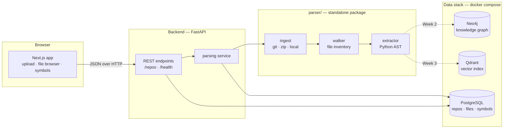

# ARGUS — Architecture Overview

**Status:** end of Week 1 (foundation + parser skeleton). This document describes
what exists today and the seams the later weeks plug into. It is updated as the
system grows, not rewritten.

---

## The problem

Engineers joining a large codebase spend weeks building a mental model of it:
what calls what, which files move together, what breaks if a function changes.
That model lives in people's heads and leaves when they do.

ARGUS builds it mechanically. It ingests a repository, extracts structural facts
from the source, stores them as both a graph and a vector index, and answers
questions about architecture, change impact, and technical debt against those
facts rather than against a language model's guesses.

---

## System shape



Solid arrows exist today. Dotted arrows are the next two weeks.

---

## Components

### `parser/` — the extraction package

A standalone, **stdlib-only** Python package that knows nothing about FastAPI,
SQLAlchemy, or HTTP. That independence is deliberate: it can be run from a CLI,
imported by the API, or executed in CI without dragging a web framework along,
and it can be tested without a database.

| Module | Responsibility |
|---|---|
| `ingest.py` | Get a repo onto disk — shallow `git clone`, zip extraction, or a local directory used in place. Enforces the size limit, rejects zip-slip archives, strips GitHub's wrapper directory. |
| `walker.py` | Traverse the tree, prune ~27 vendor/cache directories, filter to `.py`/`.pyi`, and record size, line count, sha256 and dotted module path per file. Every exclusion is recorded with a reason. |
| `extractor.py` | Parse each file's AST into dataclasses: classes, functions, methods, nested definitions, decorators, base classes, docstrings, full signatures, imports, and call sites. |
| `models.py` | The output schema — the contract everything downstream depends on. |
| `cli.py` | `python -m parser.cli <source>` — file inventory, `--symbols` for extraction, `--json` for the machine-readable form. |

### `backend/` — the API

FastAPI + SQLAlchemy 2.0 + Alembic. Configuration comes from the repo-root
`.env` through a single cached `Settings` object; nothing reads `os.environ`
directly. `app/services/parsing.py` is the only module that imports the parser,
which keeps the seam between the two halves in one file.

### `frontend/` — the UI

Next.js 15 App Router with React 19, no CSS framework. Two pages: an ingestion
form with a repository list, and a repository view with a file browser and a
symbol list. Polling is conditional — the page only polls while a parse is
actually in flight.

### Data stack

Three containers via `docker compose` (see [SETUP.md](../SETUP.md)):

- **PostgreSQL** — repositories, parse status, files, symbols. The flat source of
  truth that list endpoints read, so browsing never depends on the graph.
- **Neo4j** — the knowledge graph (Week 2). Nodes for repos, files, modules,
  classes and functions; edges for `CONTAINS`, `IMPORTS`, `CALLS`, `INHERITS`.
- **Qdrant** — symbol-level embeddings for retrieval (Week 3).

---

## The parser output schema

This is the most load-bearing decision in the project. The graph writer and the
chunker both build on these shapes, and changing them after Week 1 costs about
two days of rework, so the schema was frozen early and is extended by **adding**
fields rather than renaming them.

```
RepoInventory        name, root, source_kind, commit_sha, default_branch
  └── FileInfo       path, module, language, size_bytes, line_count, sha256
  └── SkippedPath    path, reason

ParsedRepo           inventory + per-file extraction
  └── ParsedFile     path, module, docstring, error
        ├── Symbol   name, qualname, kind, line_start/end, parent, docstring,
        │            decorators, parameters, returns, is_async, base_classes
        ├── ImportRef  module, name, alias, level, is_from
        └── CallRef    callee, line, caller, arg_count
```

Three properties matter:

**Paths are the identity.** Every path is POSIX-separated and relative to the
repo root, so a record means the same thing on any machine.

**Qualnames are flattened.** A nested function is `outer.inner`, not CPython's
`outer.<locals>.inner`; a nested class is `Record.Meta`. `module + "." + qualname`
is unique repo-wide, which makes it usable directly as a graph node key.

**Nothing is resolved.** `from . import config` keeps its relative depth and
`helper()` stays a bare name. Resolving either requires the whole repository's
symbol table, which is Week 2's job. Recording the raw text means a re-resolve
never requires re-reading the source.

---

## Ingestion flow

```
POST /repos {url}
  → create Repository row (status=pending), return 202 immediately
  → background task:
      ingest      clone/extract into WORKSPACE_DIR
      walk        inventory the source files
      extract     AST → symbols, imports, calls
      persist     replace this repo's file and symbol rows in one transaction
      status      → complete (or failed, with the error on the row)

UI polls GET /repos/{id} until the status settles.
```

The request returns before the parse begins because a real repository takes
minutes — far longer than any sensible HTTP timeout. Re-parsing **replaces** a
repository's rows rather than merging them, so stale paths cannot survive a
re-parse.

Failure is data, not an exception. A syntax error yields a `ParsedFile` with
`error` set and the run continues, so one unparseable file costs you that file
rather than the whole repository. Ingestion failures land on the repository row
as `status=failed` with a message the UI displays.

---

## API surface

| Method | Path | Purpose |
|---|---|---|
| `GET` | `/health` | Liveness. Reports Postgres connectivity but always returns 200, so it is usable as a container probe. |
| `POST` | `/repos` | Ingest from a git URL. Returns 202. |
| `POST` | `/repos/upload` | Ingest from a zip archive (multipart). |
| `GET` | `/repos` | Paginated repository list. |
| `GET` | `/repos/{id}` | Status and counts — the polling endpoint. |
| `GET` | `/repos/{id}/files` | Paginated file list, `?search=` by path. |
| `GET` | `/repos/{id}/symbols` | Paginated symbols, filterable by `file_id`, `kind`, `search`. |
| `POST` | `/repos/{id}/reparse` | Re-run the parser against the original URL. |
| `DELETE` | `/repos/{id}` | Remove a repository; files and symbols cascade. |

List endpoints return `{items, total, limit, offset}`. The `total` is what lets
the UI say "showing 500 of 807" instead of quietly truncating.

---

## Design decisions

**The parser is a separate package, not a backend module.** It has no framework
dependencies and its tests need no database. The cost is that the backend
currently puts it on `sys.path` at import time; Week 6 replaces that with a real
editable install.

**Chat and embedding providers are configured independently.** Anthropic has no
embeddings endpoint, so a single `LLM_PROVIDER` setting would be a dead end.
`LLM_PROVIDER` and `EMBEDDING_PROVIDER` are separate, behind two interfaces
(`ChatProvider.complete()`, `EmbeddingProvider.embed()`), each selected by one
env var.

**Postgres holds the flat facts; Neo4j will hold the relationships.** Listing a
repository's files should not require the graph to be healthy. The graph answers
traversal questions — dependents, blast radius — that SQL is bad at.

**Symbol signatures are stored as JSONB, not child tables.** Nothing queries
inside a parameter list yet, and Week 3's chunker wants the whole signature back
in a single read.

---

## Deliberately deferred

| Deferred | Until | Why |
|---|---|---|
| Authentication | Week 5 | Adds no demo value; roughly half a day whenever it is wanted. |
| Multi-language parsing | Possibly never | Python-only is the first scope cut if the schedule slips. The extension point is one extension→language map plus an extractor. |
| Real background workers | Week 2 | FastAPI `BackgroundTasks` is enough for one parse at a time; it does not survive a restart. |
| Import and call **resolution** | Week 2 | Needs the full symbol table, and records a confidence per edge. |
| Persisting imports and calls | Week 2 | They are extracted today but only counted in Postgres; they land in Neo4j where they are actually useful. |
| Performance work | Week 5 | Correctness first. Target is a 1000-file repo parsed in under 5 minutes. |

---

## Running it

See [SETUP.md](../SETUP.md) for full instructions.

```bash
docker compose up -d
cd backend && alembic upgrade head && uvicorn app.main:app --reload
cd frontend && npm run dev
```

The parser also runs standalone, which is the fastest way to see what ARGUS
extracts without any of the rest of the stack:

```bash
cd parser && python -m parser.cli https://github.com/psf/requests.git --symbols
```
